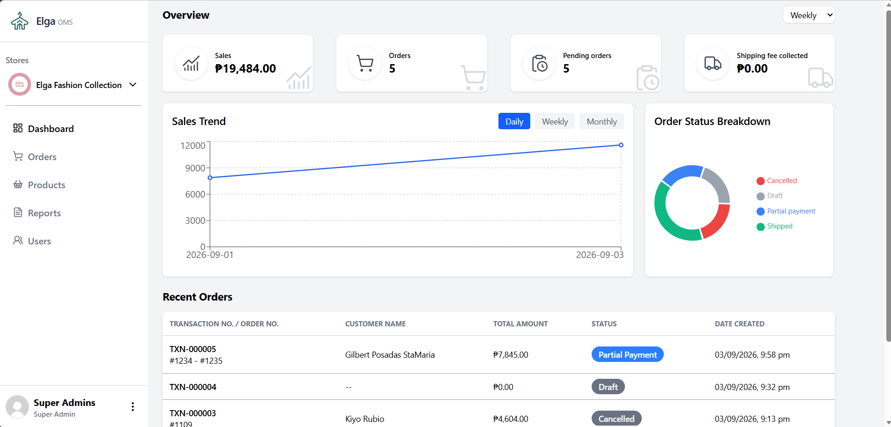
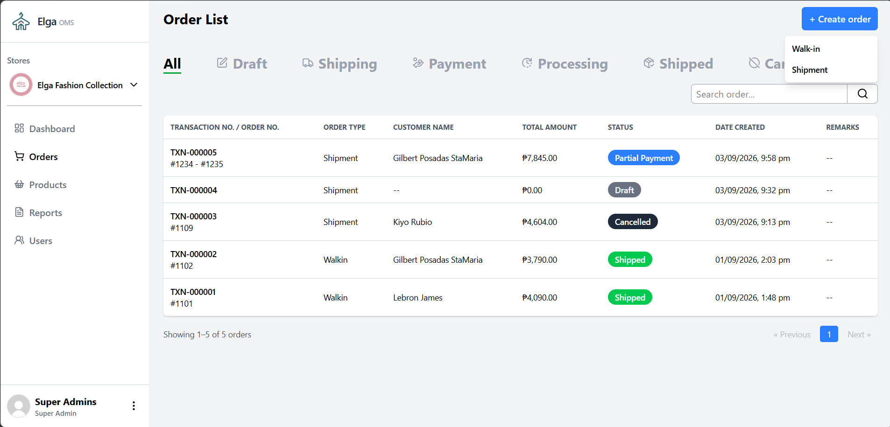
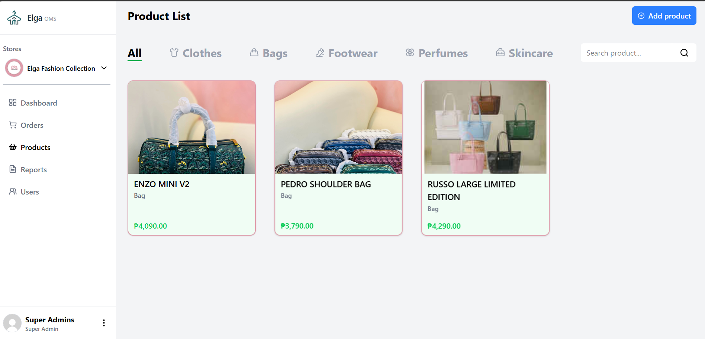
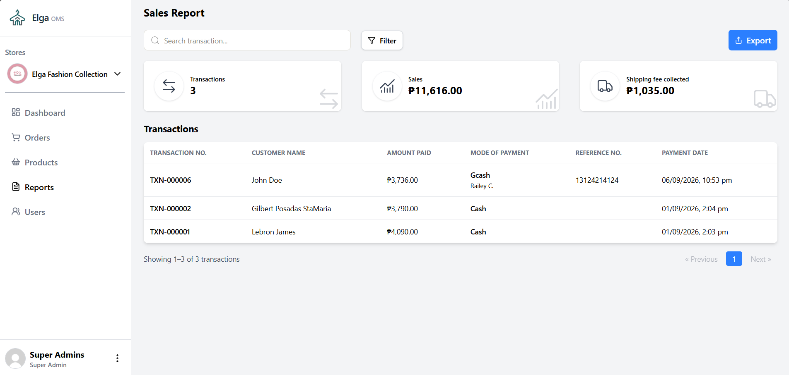

# Elga Order Management System

A web-based Order Management System designed to centralize and streamline order processing, payment tracking, inventory, shipping, and sales reporting for a fashion retail business.

---

## Overview

The Elga Order Management System was developed to improve the way a fashion retail business manages customer orders and daily operations.

The system centralizes order information that was previously handled across social media orders, third-party order management tools, and spreadsheets. It provides employees with a single system for managing products, customers, orders, payments, shipments, and reports.

> **Status:** The project is currently undergoing testing and refinement before deployment.

---

## Problem

The existing workflow involved managing orders through multiple platforms and manually encoding information into spreadsheets. This created several challenges:

- Repeated data entry
- Difficulty tracking order status
- Scattered payment information
- Manual shipment tracking
- Inconsistent order records
- Limited visibility into sales and payment reports

## Solution

I developed a centralized Order Management System that allows employees to manage the complete order lifecycle from a single application.

The system provides structured workflows for:

**Customer → Order → Shipping → Payment → Processing → Shipment → Completion**

This reduces repetitive encoding and provides a clearer overview of the current state of each order.

---

## Key Features

### Order Management

- Create and manage customer orders
- Support for shipment and walk-in orders
- Automatic transaction number generation
- Order status tracking
- Order status history
- Order cancellation
- Order completion tracking

### Product Management

- Product and category management
- Product variants
- Product pricing
- Shop-specific products
- Product search and filtering

### Payment Management

- Record full payments
- Record down payments
- Record balance payments
- Support partial payments
- Payment proof uploads
- Payment status tracking
- Automatic remaining balance calculation
- Overpayment validation

### Shipping Management

- Shipping address management
- Shipping fee tracking
- Courier information
- Tracking number
- Additional shipping charges
- Shipment status tracking

### Sales and Reports

- Sales reporting
- Payment method filtering
- Order type filtering
- Daily, weekly, monthly, and yearly reports
- Custom date ranges
- Payment-based reporting
- Shop-specific reporting

### Multi-Shop Support

The system supports multiple shops within the same application.

Employees can switch between active shops while maintaining a shared employee account and accessing the appropriate products, customers, orders, and reports for the selected shop.

---

## Order Workflow

The system follows a structured order lifecycle:

```text
Customer
   ↓
Order Creation
   ↓
Payment
   ↓
Payment Confirmation
   ↓
Processing
   ↓
Receipt Printing
   ↓
Packaging
   ↓
Shipment
   ↓
Completed
```

Walk-in orders use a simplified workflow that does not require shipping information.

---

## Tech Stack

### Frontend

- React
- Inertia.js
- Tailwind CSS
- Vite
- Recharts
- SweetAlert2
- Lucide React

### Backend

- Laravel
- PHP
- MySQL

### Development Tools

- Git
- GitHub
- VS Code

---

## Screenshots

| Dashboard | Order Management |
| :---: | :---: |
|  |  |

| Order Details | Product Management |
| :---: | :---: |
|  |  |

| Reports |
| :---: |
|  |

> Replace the image paths above with your actual screenshot files.

---

## Installation

### 1. Clone the repository

```bash
git clone https://github.com/gilbeee-web/Elga-data-management-system.git
cd Elga-data-management-system
```

### 2. Install PHP dependencies

```bash
composer install
```

### 3. Install JavaScript dependencies

```bash
npm install
```

### 4. Configure environment

Create a `.env` file:

```bash
cp .env.example .env
```

Then configure your database connection in `.env`.

### 5. Generate application key

```bash
php artisan key:generate
```

### 6. Run database migrations

```bash
php artisan migrate
```

### 7. Run database seeder to generate a sample user account

```bash
php artisan db:seed
```

### 8. Start the development server

Run Laravel:

```bash
php artisan serve
```

Run Vite (in a separate terminal):

```bash
npm run dev
```

The application can then be accessed through the local development URL provided by Laravel/Vite.

---

## Current Status

**Status: Testing / Development**

The system is currently being tested and refined. Current development focuses on validating order workflows, payment calculations, reporting accuracy, multi-shop functionality, and overall usability.

---

## Future Improvements

Planned improvements may include:

- Inventory automation
- POS integration
- Additional sales analytics
- Expense and petty cash management
- Improved customer-facing product catalog
- Additional notification features
- Production deployment

---

## Author

**Gilbert Sta. Maria**
Junior Full-Stack Web Developer

- Portfolio: [my-portfolio-rust-nu-38.vercel.app](https://my-portfolio-rust-nu-38.vercel.app/)
- GitHub: [github.com/gilbee-web](https://github.com/gilbee-web)
